# Architecture

## Overview

This document describes the complete architecture of the Intelligent Document Processing & RAG Platform. The system follows a **Modular Monolith + Asynchronous Worker** architecture pattern.

## System Architecture

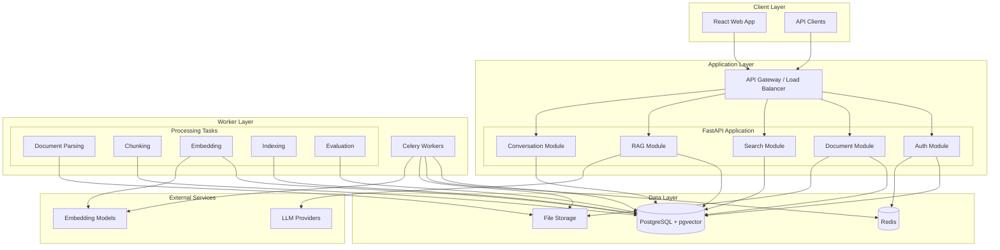

## Backend Architecture

### Layered Architecture

The backend follows a strict layered architecture:

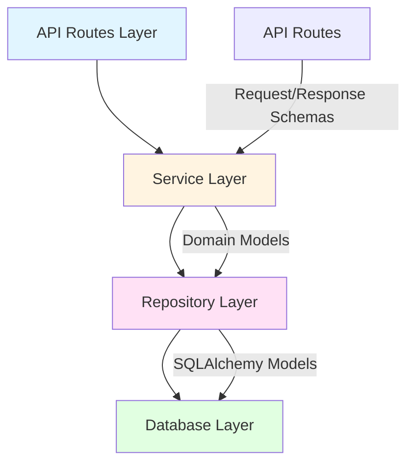

### Module Structure

Implemented in Phase 1 (modules are added only when a phase needs them):

```
backend/
├── app/
│   ├── main.py             # Application factory (create_app / get_app)
│   ├── config.py           # Pydantic Settings, fail-fast validation
│   ├── dependencies.py     # FastAPI dependency providers
│   ├── exceptions.py       # AppError base class
│   ├── redis.py            # Redis client factory and probe
│   ├── api/
│   │   ├── router.py       # /api/v1 router (+ root health routes for orchestrators)
│   │   ├── routes/         # Route handlers (orchestration only)
│   │   ├── middleware/     # Request-context (request ID, access log) middleware
│   │   ├── error_handlers.py
│   │   └── responses.py    # Response/error envelope builders
│   ├── schemas/            # Pydantic API schemas
│   ├── services/           # Auth, Collection, Document, Processing and Health services
│   ├── models/             # SQLAlchemy models (User, Role, RefreshToken)
│   ├── db/                 # Base, async engine/session, DB probe, repositories/
│   ├── security/           # Passwords, JWT, refresh tokens, denylist, rate limit, RBAC, file validation
│   ├── core/documents/     # Types, lifecycle, processing errors, normalisation, script profile
│   ├── parsers/            # DocumentExtractor interface and PDF/DOCX/text/Markdown extractors
│   ├── observability/      # JSON logging, request-ID context
│   ├── workers/            # Celery app, queue dispatcher, document tasks and recovery sweep
│   └── storage/            # StorageProvider interface, local filesystem backend
├── alembic/                # Migrations (0001 pgvector, 0002 auth, 0003 documents/collections, 0004 processing)
└── tests/                  # unit, api, integration
```

Planned layers added in later phases: `repositories/` (data access), `models/`, `core/`
(domain logic), `parsers/`, `embeddings/`, `llm/`, `retrieval/`, `security/`.

Dependency direction: `api -> services -> (db | redis | storage)`. Infrastructure modules
(`db`, `redis`, `storage`, `observability`) never import from `api` or `services`.

### Dependency Injection

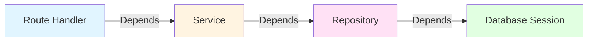

**Example**:
```python
# routes/documents.py
@router.post("/documents")
async def upload_document(
    file: UploadFile,
    current_user: User = Depends(get_current_user),
    doc_service: DocumentService = Depends(get_document_service),
):
    return await doc_service.upload_document(file, current_user.id)

# services/document_service.py
class DocumentService:
    def __init__(self, doc_repo: DocumentRepository):
        self.doc_repo = doc_repo

# repositories/document_repository.py
class DocumentRepository:
    def __init__(self, db: AsyncSession):
        self.db = db
```

## Frontend Architecture

### Component Structure

```
frontend/
├── src/
│   ├── components/       # Reusable UI components
│   │   ├── common/       # Buttons, inputs, modals
│   │   ├── layout/       # Layout components
│   │   └── features/     # Feature-specific components
│   │
│   ├── pages/            # Page components
│   │   ├── Documents/
│   │   ├── Search/
│   │   ├── Conversations/
│   │   └── Settings/
│   │
│   ├── hooks/            # Custom React hooks
│   │   ├── useAuth.ts
│   │   ├── useDocuments.ts
│   │   └── useSearch.ts
│   │
│   ├── services/         # API client services
│   │   ├── api.ts
│   │   ├── authApi.ts
│   │   └── documentApi.ts
│   │
│   ├── store/            # State management
│   │   ├── authSlice.ts
│   │   └── documentSlice.ts
│   │
│   └── types/            # TypeScript types
│       ├── document.ts
│       ├── search.ts
│       └── conversation.ts
```

### State Management

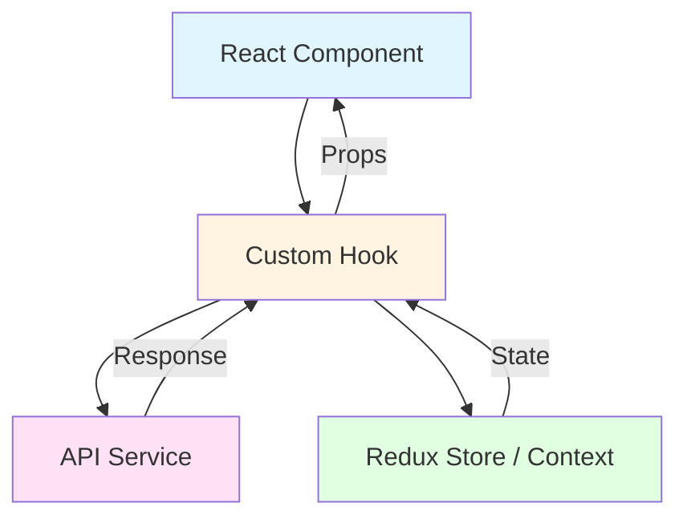

## Worker Architecture

### Celery Task Hierarchy

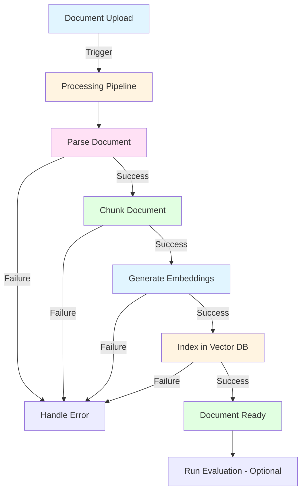

### Task Queue Configuration

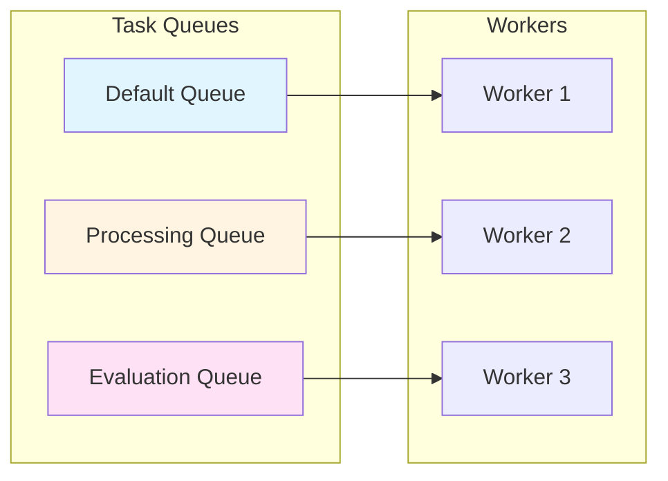

## Data Flow

### Document Ingestion Flow

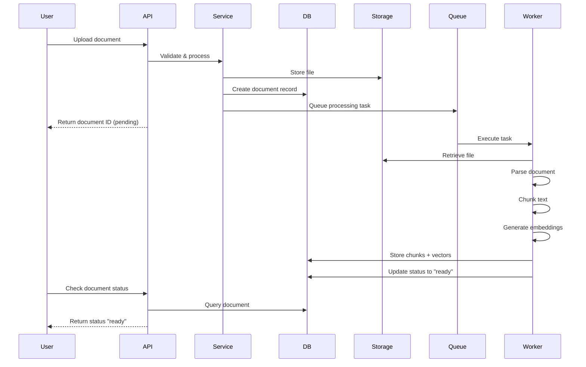

### RAG Query Flow

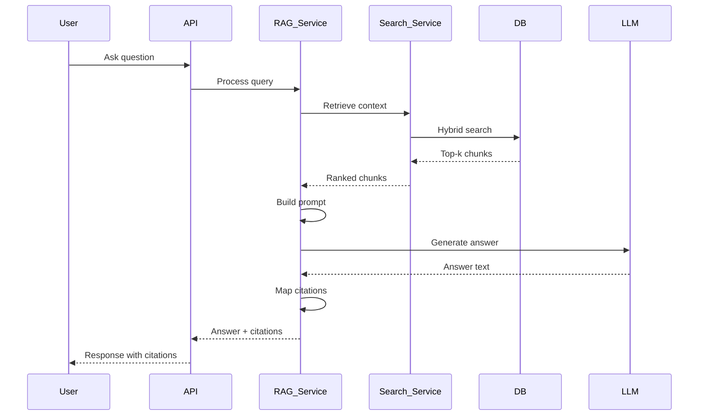

### Authentication Flow

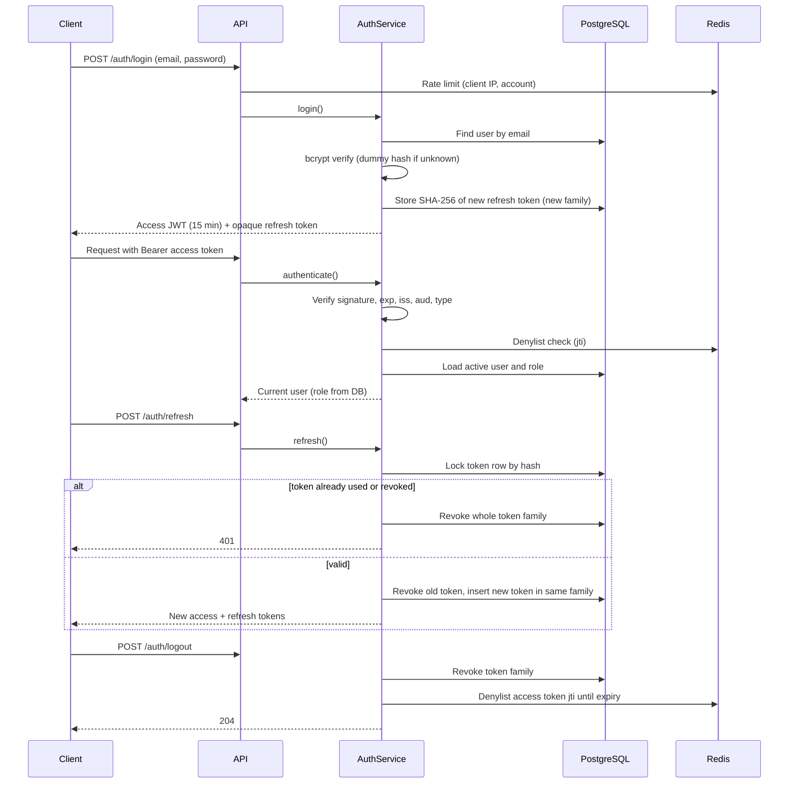

## Storage Architecture

### File Storage

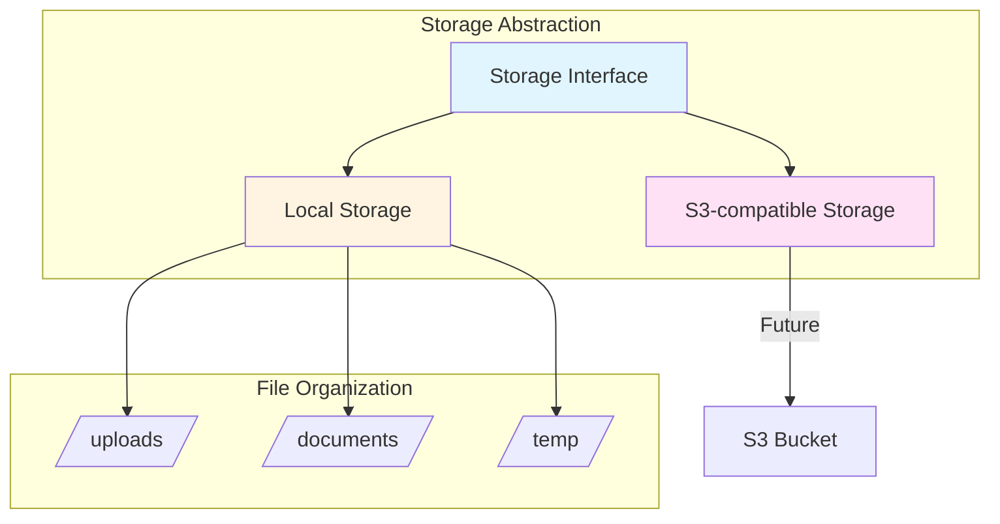

**Object Keys**: opaque and generated (`documents/{2 hex}/{32 hex}`). They contain no user ID, document
name, version or file name, so they can be neither guessed nor used to traverse a path. Ownership and
display names live only in PostgreSQL. (This replaces the earlier `/{user_id}/{document_id}/{version}/{filename}` sketch; see DEC-018.)

**Interface** (`app/storage/base.py`): `save(key, chunks)` streams bytes in and returns size and SHA-256;
`open(key)` streams bytes out; `size`, `exists` and `delete` complete it. The local filesystem backend is
implemented; an S3-compatible backend only needs to implement the same five methods.

### Document Lifecycle

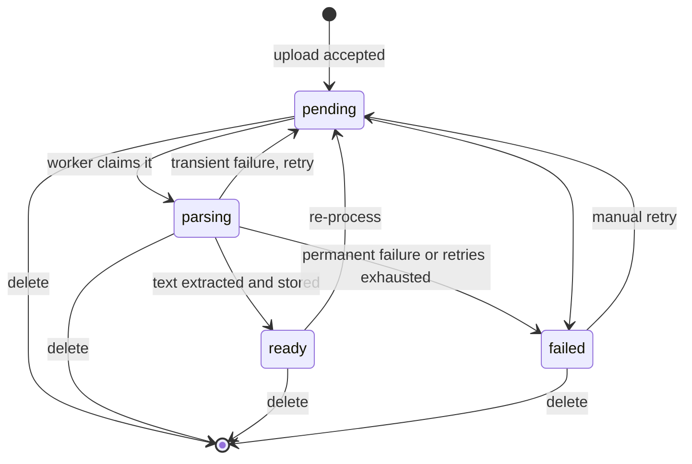

In the current pipeline `pending` means *uploaded and queued* and `parsing` means *being processed*
(extract, normalise, persist). `ready` means the document's text has been extracted and stored; it does not yet mean
searchable. The `chunking`, `embedding` and `indexing` states remain defined for later phases, and the
temporary `parsing -> ready` shortcut will be replaced by `parsing -> chunking` when they arrive.
Transitions are enforced by `ensure_transition` (`app/core/documents/lifecycle.py`) and, for the worker,
by guarded `UPDATE ... WHERE status = ...` statements. `error_message` and `failure_reason` are only allowed
while `failed` (database CHECK). Deletion is a hard delete, so there is no `deleted` status.

### Upload Flow

```mermaid
sequenceDiagram
    participant C as Client
    participant API
    participant Svc as DocumentService
    participant S as StorageProvider
    participant DB as PostgreSQL

    C->>API: POST /documents (multipart)
    API->>API: Body size cap, authenticate, rate limit
    API->>Svc: upload(user, file)
    Svc->>Svc: Validate type, size, structure; SHA-256
    Svc->>DB: Duplicate check (user, checksum)
    Svc->>S: save(generated key, stream)
    S-->>Svc: size + SHA-256 (verified)
    Svc->>DB: INSERT document + collection links, COMMIT
    alt insert fails
        Svc->>S: delete(key)
    end
    Svc-->>C: 201 Document (status pending)
```

### Processing Pipeline

```mermaid
sequenceDiagram
    participant API
    participant Q as Redis (Celery queue)
    participant W as Celery worker
    participant DB as PostgreSQL
    participant S as StorageProvider

    API->>DB: INSERT document (pending), COMMIT
    API->>Q: enqueue process_document(id)
    Note over API,Q: if the broker is down the upload still succeeds; the sweep re-queues
    Q->>W: deliver task
    W->>DB: claim: UPDATE ... SET status=parsing WHERE status=pending
    alt not claimable (done, deleted or owned by another worker)
        W-->>Q: acknowledge and skip
    else claimed
        W->>S: read stored file (size verified)
        W->>W: extract (PyMuPDF / python-docx / text), enforcing limits
        W->>W: normalise Unicode and whitespace per section
        W->>DB: replace sections, set counts and metadata, status=ready
        alt transient failure and attempts remain
            W->>DB: status=pending, retry after backoff
        else permanent failure
            W->>DB: status=failed, failure_reason, safe message
        end
    end
    loop every 60 s (Celery beat)
        W->>DB: release stalled parsing, re-queue lost pending
    end
```

The API never parses a document. A worker process handles one document at a time per task slot, with a
cooperative time budget (checked between pages/sections), Celery soft and hard time limits as a backstop,
and recycling after a number of tasks or a memory threshold.

### Extraction and Normalization

Extractors share one interface (`DocumentExtractor`, `app/parsers/base.py`) and return ordered sections
of raw text plus untrusted file properties. The pipeline then normalises each section independently, so page and
heading boundaries are never merged away.

| Format | Library | Sections produced | Notes |
|--------|---------|-------------------|-------|
| PDF | PyMuPDF | one `page` section per page (1-based `page_number`), blank pages kept | encrypted PDFs rejected; text layer only (no OCR) |
| DOCX | python-docx | one `section` per heading (levels 1-9, Title = 1) plus an optional leading `body`; table rows are kept as one line per row; headers, footers, comments and macros are ignored |
| Markdown | native | one `section` per ATX heading (`#`..`######`), headings inside code fences ignored | source is kept verbatim; nothing is rendered |
| TXT | native | one `body` section | UTF-8 (BOM tolerated) |

Normalisation (`app/core/documents/normalization.py`) is deliberately conservative: Unicode NFC (not NFKC),
`\r\n`/`\r`/U+2028/U+2029 to `\n`, Unicode spaces to a plain space, runs of blank lines collapsed to one, and invisible or
control artefacts removed (NUL, controls, soft hyphen, zero-width space, BOM, bidi overrides). It preserves case,
punctuation, combining marks and, importantly, ZWJ/ZWNJ (U+200D/U+200C), which Bengali conjuncts depend on. PDF and DOCX also
collapse repeated spaces inside lines; plain text and Markdown keep interior spacing and indentation. There is no lowercasing,
stemming, stop-word removal or translation. Bengali "nukta" letters that Unicode defines as composition exclusions (for example U+09DF) are stored in
their canonical decomposed form; the same normalisation must be applied to queries in later phases.

A dependency-free **script profile** (Bengali / Latin / other shares and a primary script of `bengali`, `latin`, `mixed`, `other` or `unknown`) is
stored with each document. It is a heuristic about writing systems, not language identification.

### Content Model

Processed text lives in `document_sections` (one row per page or section: `ordinal`, `kind`, `page_number`,
`heading`, `heading_level`, `text`, `char_count`), referenced by `document_id` with cascade delete. A later chunker
reads sections in order and can attach each chunk to a page or heading, so citations keep their source location.
Per-document counts, timestamps and metadata sit on `documents` (`page_count`, `character_count`,
`processing_started_at`, `processing_completed_at`, `processing_metadata` with extractor, processing version, duration, script profile and sanitised file properties).
Re-processing replaces a document's sections inside the same transaction that marks it `ready`, so retries never duplicate content.

### Failure Handling and Recovery

- Every failure is classified (`FailureReason`): `storage_missing`, `storage_unavailable`, `corrupt_document`, `encrypted_document`, `unsupported_format`, `empty_document`, `too_many_pages`, `content_too_large`, `timeout`, `extraction_failed`, `database_error`, `retries_exhausted`. Users see the code and a fixed, safe message, never exception text.
- Only transient classes (`storage_unavailable`, `database_error`) are retried automatically, with exponential backoff, up to `PROCESSING_MAX_ATTEMPTS`. Everything else fails once, so a poisonous document cannot loop.
- A worker claims a document with a single guarded `UPDATE`, so duplicate or redelivered tasks cannot process it twice. A worker that dies mid-task leaves the document in `parsing`; once it is older than `PROCESSING_STALE_AFTER_SECONDS` it can be re-claimed, and the beat sweep releases it (or fails it after the attempt budget). Pending documents whose queue message was lost are re-queued by the same sweep.
- `POST /documents/{id}/retry` lets the owner re-queue a failed document with a fresh attempt budget.

### Database Storage

PostgreSQL with pgvector extension:

**Relational Data**:
- Users, roles, permissions
- Documents, collections, versions
- Conversations, messages
- Evaluation runs and results

**Vector Data**:
- Document chunk embeddings
- Vector index for similarity search

### Cache Storage

Redis used for:
- Session storage
- API response caching
- Celery task broker
- Rate limiting counters

## AI Architecture

### Embedding Architecture

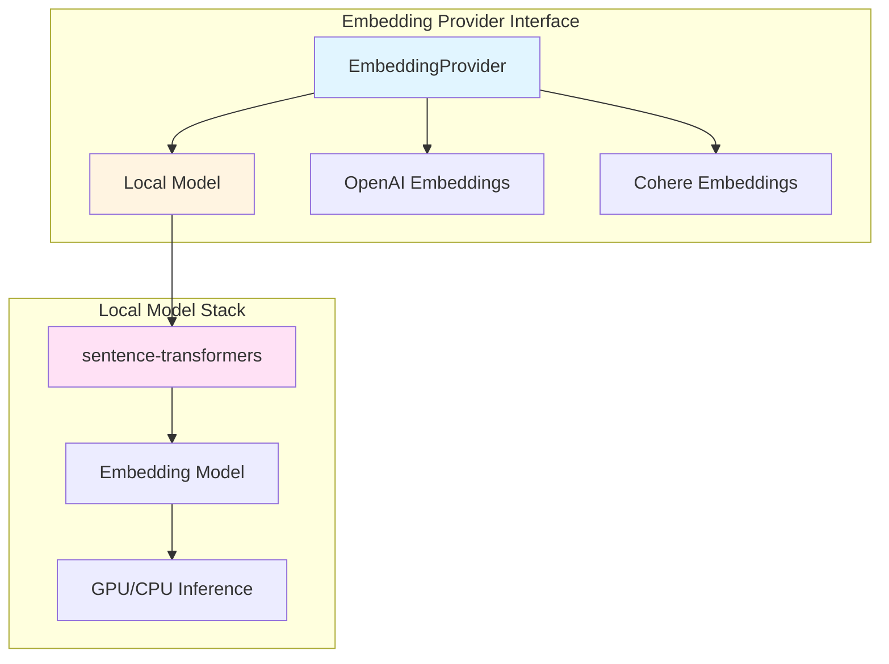

### LLM Architecture

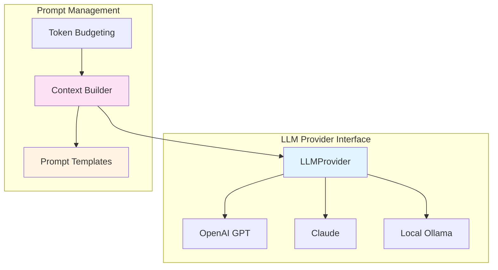

### Retrieval Architecture

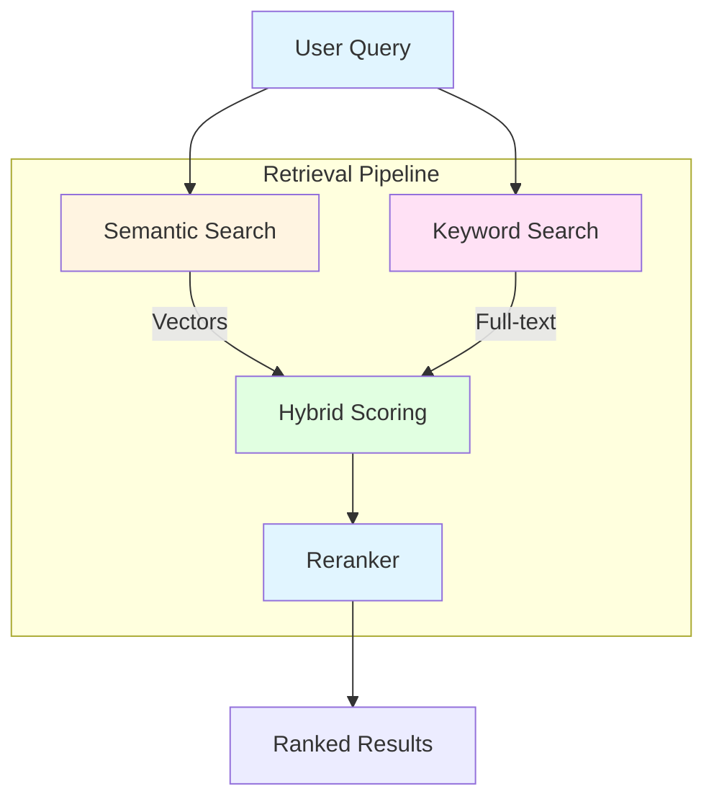

## Failure Boundaries

### Failure Isolation

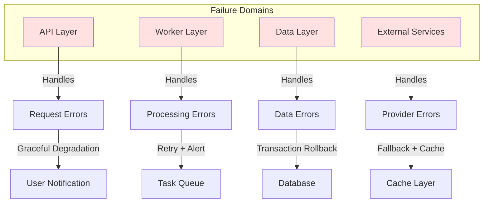

### Error Handling Strategy

| Failure Type | Handling | User Impact |
|--------------|----------|-------------|
| API Request Error | Return error response | User sees error message |
| Database Error | Rollback transaction | Operation fails gracefully |
| Worker Error | Retry with exponential backoff | Processing delayed |
| LLM Provider Error | Try alternate provider or return cached | Answer may be unavailable |
| Embedding Error | Queue for retry | Processing delayed |
| File Storage Error | Mark document as failed | Upload fails, user notified |

## Scalability Considerations

### Horizontal Scaling Points

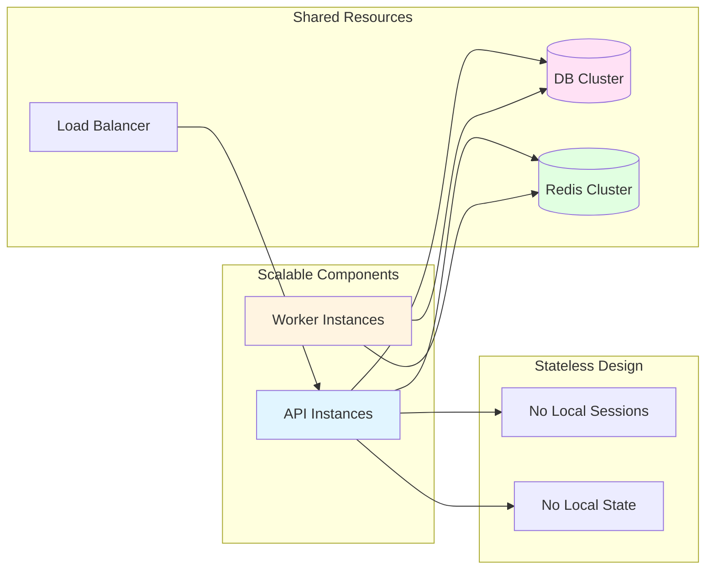

### Scalability Path

**Current (Phase 0-16)**:
- Single API instance
- Single worker instance
- Single database instance
- Single Redis instance

**Future Scaling**:
1. Multiple API instances behind load balancer
2. Multiple workers for processing throughput
3. Database read replicas
4. Redis cluster for high availability
5. CDN for static assets

## Security Architecture

### Security Layers

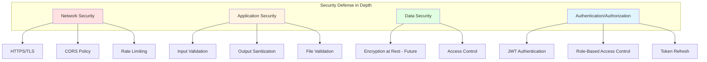

### Authorization Model

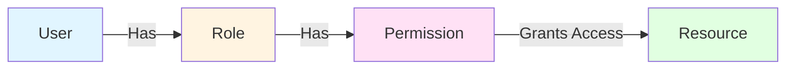

## Observability Architecture

### Logging Pipeline

```mermaid
graph LR
    App[Application]
    StructuredLog[Structured Logging]
    RequestID[Request ID]
    
    App --> StructuredLog
    StructuredLog --> RequestID
    RequestID --> |JSON Format| Logs[Log Aggregation]
    
    style App fill:#e1f5ff
    style StructuredLog fill:#fff4e1
    style RequestID fill:#ffe1f5
    style Logs fill:#e1ffe1
```

### Monitoring Points

- **Application Metrics**: Request count, latency, error rate
- **Database Metrics**: Query time, connection pool, slow queries
- **Worker Metrics**: Task throughput, failure rate, queue depth
- **Search Metrics**: Query latency, result count, cache hit rate
- **LLM Metrics**: Token usage, latency, cost

## Deployment Architecture

### Development Environment

```mermaid
graph TB
    Dev[Developer Machine]
    
    subgraph "Docker Compose"
        API[FastAPI Container]
        Worker[Celery Container]
        DB[PostgreSQL Container]
        Redis[Redis Container]
        Frontend[React Container]
    end
    
    Dev --> API
    Dev --> Frontend
    API --> DB
    API --> Redis
    Worker --> DB
    Worker --> Redis
    
    style Dev fill:#e1f5ff
    style API fill:#fff4e1
    style Worker fill:#ffe1f5
    style DB fill:#e1ffe1
```

The development stack is defined in `docker-compose.yml`: `postgres` (pgvector image),
`redis` (password-protected), a one-shot `migrate` job, `backend`, `celery_worker` and
`frontend`. The API starts only after migrations complete and its dependencies are healthy.
Database and Redis ports are published on `127.0.0.1` only.

### Production Environment (Future)

```mermaid
graph TB
    Users[Users]
    
    subgraph "Cloud Infrastructure"
        CDN[CDN]
        LB[Load Balancer]
        
        subgraph "API Tier"
            API1[API Instance 1]
            API2[API Instance 2]
        end
        
        subgraph "Worker Tier"
            Worker1[Worker 1]
            Worker2[Worker 2]
        end
        
        subgraph "Data Tier"
            DB_Primary[(DB Primary)]
            DB_Replica[(DB Replica)]
            Redis_Cluster[(Redis)]
        end
        
        subgraph "Storage"
            S3[S3-compatible Storage]
        end
    end
    
    Users --> CDN
    CDN --> LB
    LB --> API1
    LB --> API2
    API1 --> DB_Primary
    API2 --> DB_Primary
    API1 --> DB_Replica
    API2 --> DB_Replica
    API1 --> Redis_Cluster
    API2 --> Redis_Cluster
    API1 --> S3
    
    Worker1 --> DB_Primary
    Worker2 --> DB_Primary
    Worker1 --> Redis_Cluster
    Worker2 --> Redis_Cluster
    Worker1 --> S3
    
    style Users fill:#e1f5ff
    style CDN fill:#fff4e1
    style LB fill:#ffe1f5
    style API1 fill:#e1ffe1
```

---

*This architecture is designed for clarity, maintainability, and scalability. It follows the principle of starting simple and extracting services only when genuinely necessary.*
