# Architecture

## Overview

This document describes the complete architecture of the Intelligent Document Processing & RAG Platform. The system follows a **Modular Monolith + Asynchronous Worker** architecture pattern.

## System Architecture

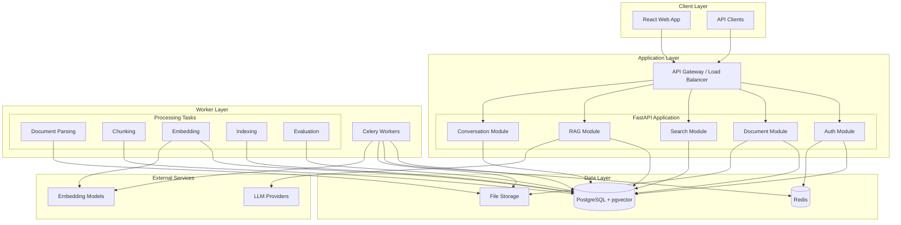

## Backend Architecture

### Layered Architecture

The backend follows a strict layered architecture:

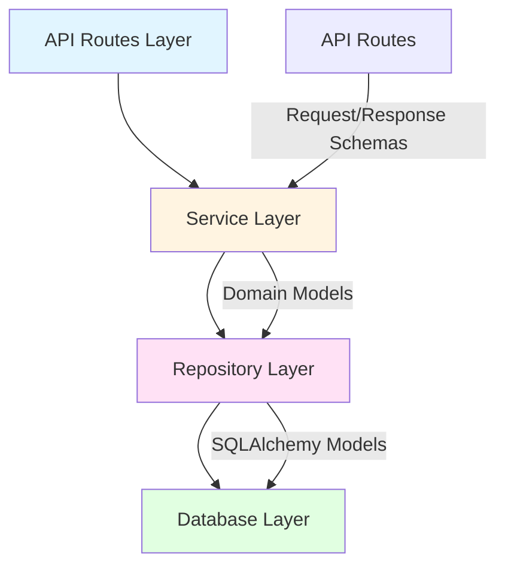

### Module Structure

Implemented in Phase 1 (modules are added only when a phase needs them):

```
backend/
├── app/
│   ├── main.py             # Application factory (create_app / get_app)
│   ├── config.py           # Pydantic Settings, fail-fast validation
│   ├── dependencies.py     # FastAPI dependency providers
│   ├── exceptions.py       # AppError base class
│   ├── redis.py            # Redis client factory and probe
│   ├── api/
│   │   ├── router.py       # /api/v1 router (+ root health routes for orchestrators)
│   │   ├── routes/         # Route handlers (orchestration only)
│   │   ├── middleware/     # Request-context (request ID, access log) middleware
│   │   ├── error_handlers.py
│   │   └── responses.py    # Response/error envelope builders
│   ├── schemas/            # Pydantic API schemas
│   ├── services/           # Service layer (HealthService so far)
│   ├── db/                 # Declarative base, async engine/session, DB probe
│   ├── observability/      # JSON logging, request-ID context
│   ├── workers/            # Celery app and tasks
│   └── storage/            # StorageProvider interface (no implementation yet)
├── alembic/                # Migrations (0001 enables pgvector)
└── tests/                  # unit, api, integration
```

Planned layers added in later phases: `repositories/` (data access), `models/`, `core/`
(domain logic), `parsers/`, `embeddings/`, `llm/`, `retrieval/`, `security/`.

Dependency direction: `api -> services -> (db | redis | storage)`. Infrastructure modules
(`db`, `redis`, `storage`, `observability`) never import from `api` or `services`.

### Dependency Injection

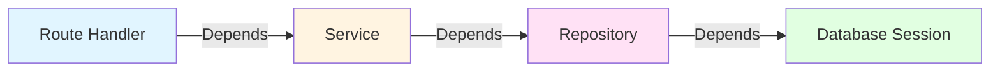

**Example**:
```python
# routes/documents.py
@router.post("/documents")
async def upload_document(
    file: UploadFile,
    current_user: User = Depends(get_current_user),
    doc_service: DocumentService = Depends(get_document_service),
):
    return await doc_service.upload_document(file, current_user.id)

# services/document_service.py
class DocumentService:
    def __init__(self, doc_repo: DocumentRepository):
        self.doc_repo = doc_repo

# repositories/document_repository.py
class DocumentRepository:
    def __init__(self, db: AsyncSession):
        self.db = db
```

## Frontend Architecture

### Component Structure

```
frontend/
├── src/
│   ├── components/       # Reusable UI components
│   │   ├── common/       # Buttons, inputs, modals
│   │   ├── layout/       # Layout components
│   │   └── features/     # Feature-specific components
│   │
│   ├── pages/            # Page components
│   │   ├── Documents/
│   │   ├── Search/
│   │   ├── Conversations/
│   │   └── Settings/
│   │
│   ├── hooks/            # Custom React hooks
│   │   ├── useAuth.ts
│   │   ├── useDocuments.ts
│   │   └── useSearch.ts
│   │
│   ├── services/         # API client services
│   │   ├── api.ts
│   │   ├── authApi.ts
│   │   └── documentApi.ts
│   │
│   ├── store/            # State management
│   │   ├── authSlice.ts
│   │   └── documentSlice.ts
│   │
│   └── types/            # TypeScript types
│       ├── document.ts
│       ├── search.ts
│       └── conversation.ts
```

### State Management

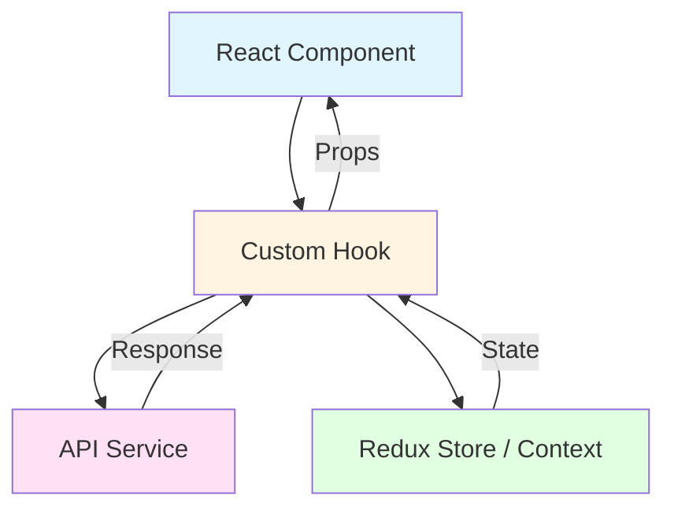

## Worker Architecture

### Celery Task Hierarchy

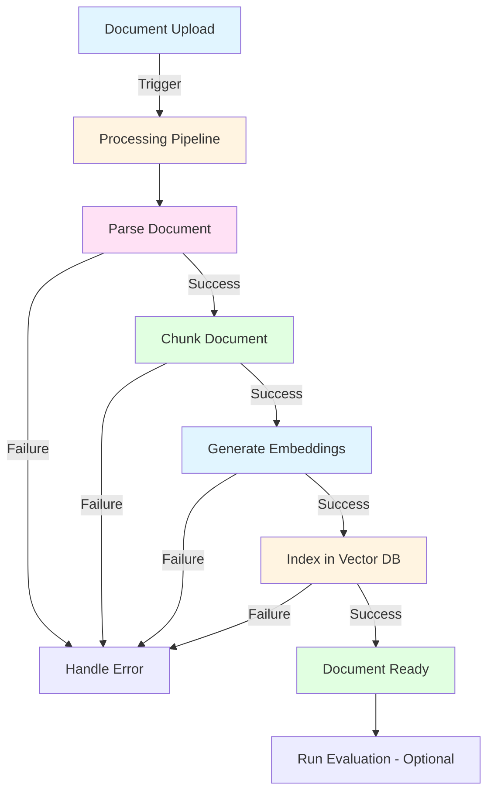

### Task Queue Configuration

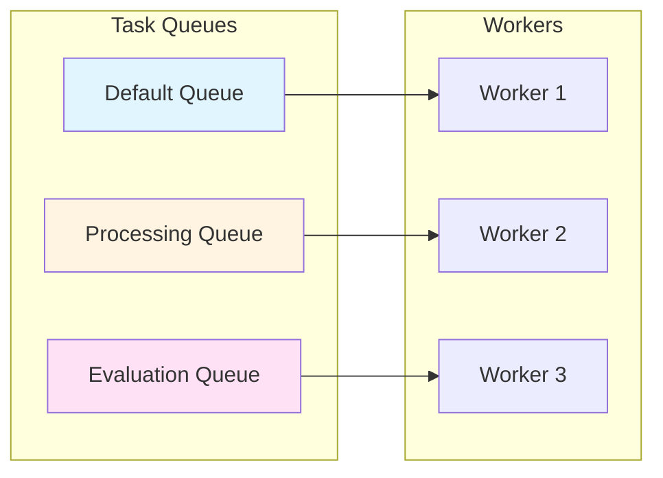

## Data Flow

### Document Ingestion Flow

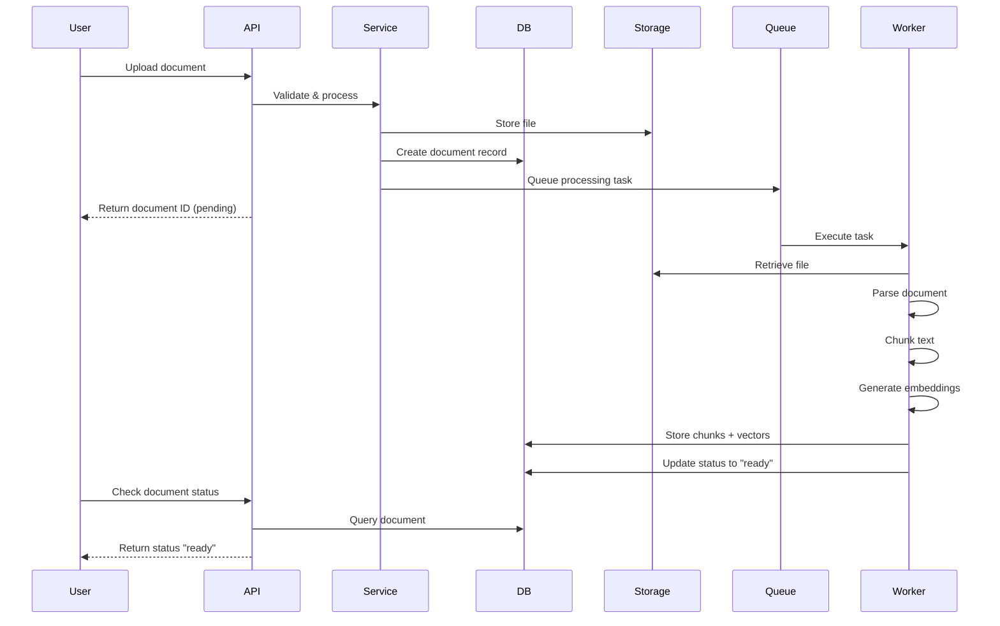

### RAG Query Flow

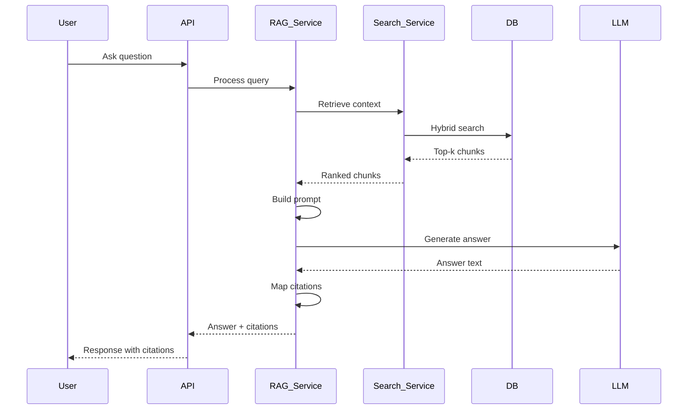

### Authentication Flow

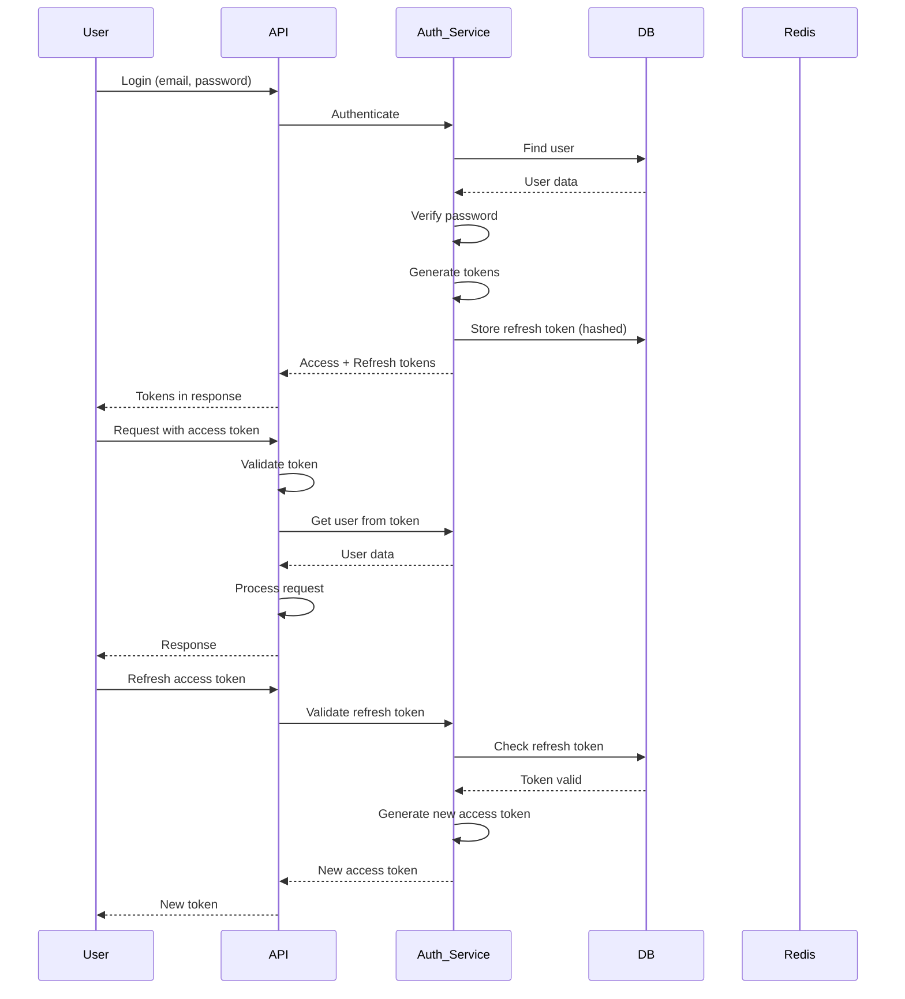

## Storage Architecture

### File Storage

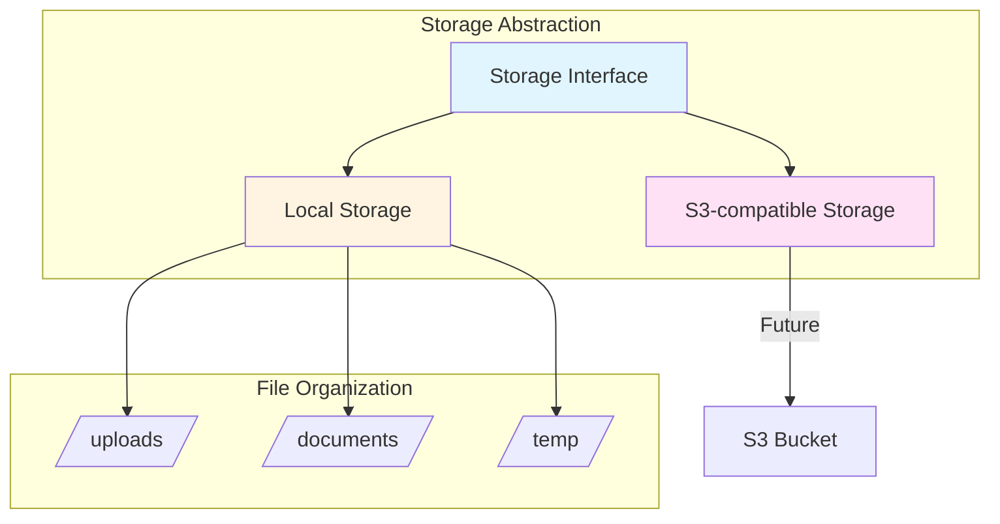

**File Path Structure**:
```
/uploads/
  └── {user_id}/
      └── {document_id}/
          └── {version}/
              └── {filename}
```

### Database Storage

PostgreSQL with pgvector extension:

**Relational Data**:
- Users, roles, permissions
- Documents, collections, versions
- Conversations, messages
- Evaluation runs and results

**Vector Data**:
- Document chunk embeddings
- Vector index for similarity search

### Cache Storage

Redis used for:
- Session storage
- API response caching
- Celery task broker
- Rate limiting counters

## AI Architecture

### Embedding Architecture

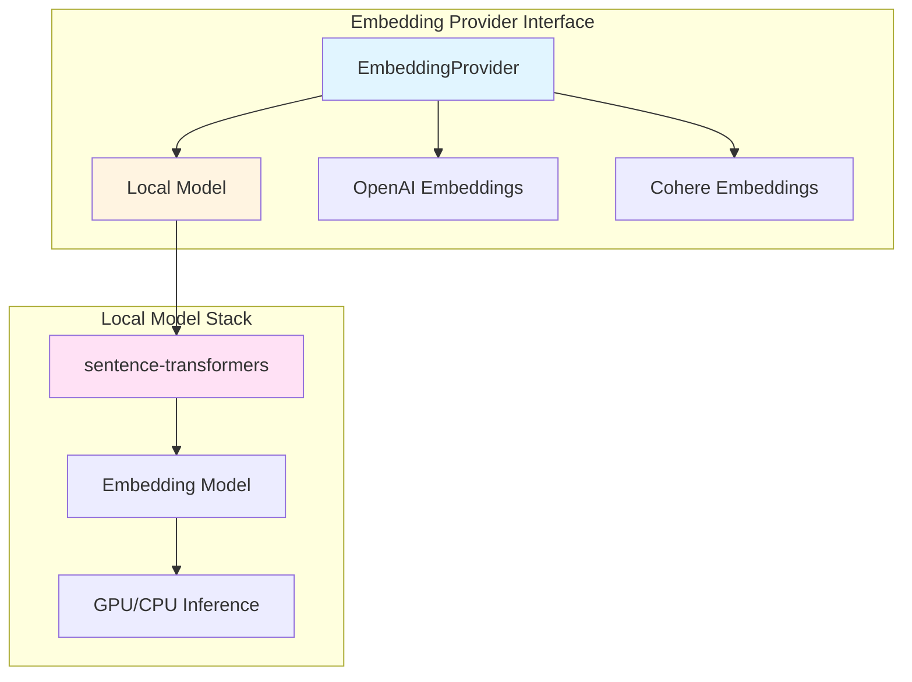

### LLM Architecture

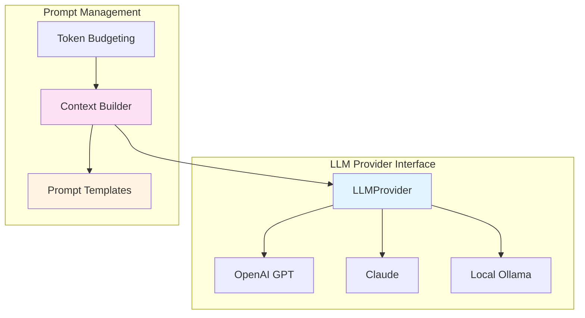

### Retrieval Architecture

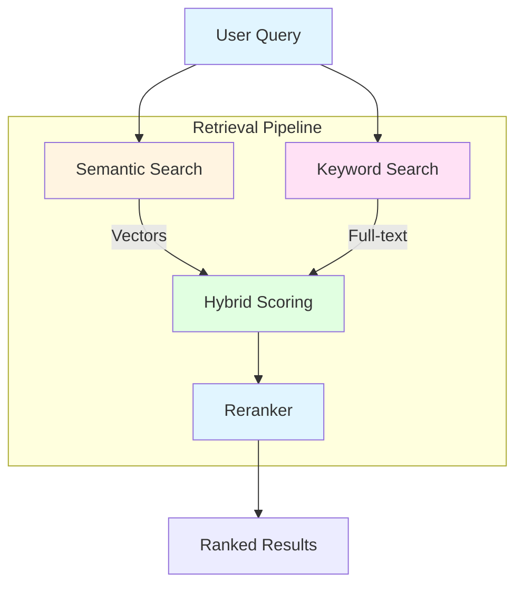

## Failure Boundaries

### Failure Isolation

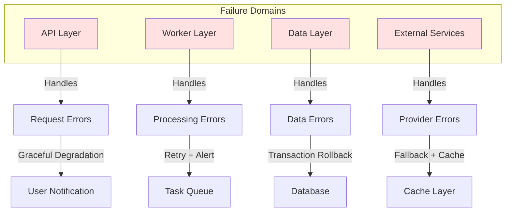

### Error Handling Strategy

| Failure Type | Handling | User Impact |
|--------------|----------|-------------|
| API Request Error | Return error response | User sees error message |
| Database Error | Rollback transaction | Operation fails gracefully |
| Worker Error | Retry with exponential backoff | Processing delayed |
| LLM Provider Error | Try alternate provider or return cached | Answer may be unavailable |
| Embedding Error | Queue for retry | Processing delayed |
| File Storage Error | Mark document as failed | Upload fails, user notified |

## Scalability Considerations

### Horizontal Scaling Points

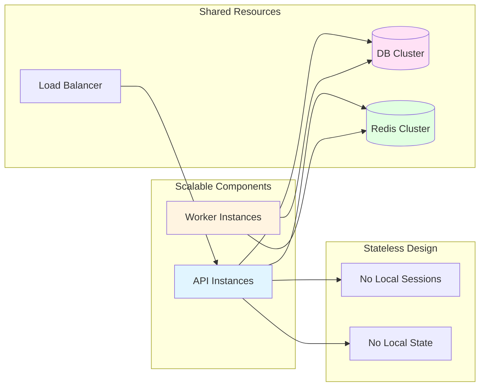

### Scalability Path

**Current (Phase 0-16)**:
- Single API instance
- Single worker instance
- Single database instance
- Single Redis instance

**Future Scaling**:
1. Multiple API instances behind load balancer
2. Multiple workers for processing throughput
3. Database read replicas
4. Redis cluster for high availability
5. CDN for static assets

## Security Architecture

### Security Layers

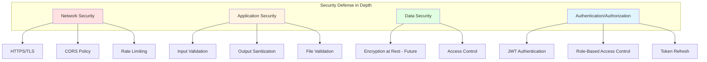

### Authorization Model

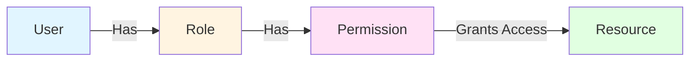

## Observability Architecture

### Logging Pipeline

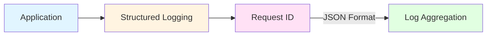

### Monitoring Points

- **Application Metrics**: Request count, latency, error rate
- **Database Metrics**: Query time, connection pool, slow queries
- **Worker Metrics**: Task throughput, failure rate, queue depth
- **Search Metrics**: Query latency, result count, cache hit rate
- **LLM Metrics**: Token usage, latency, cost

## Deployment Architecture

### Development Environment

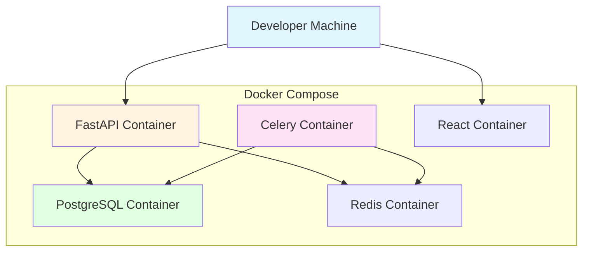

The development stack is defined in `docker-compose.yml`: `postgres` (pgvector image),
`redis` (password-protected), a one-shot `migrate` job, `backend`, `celery_worker` and
`frontend`. The API starts only after migrations complete and its dependencies are healthy.
Database and Redis ports are published on `127.0.0.1` only.

### Production Environment (Future)

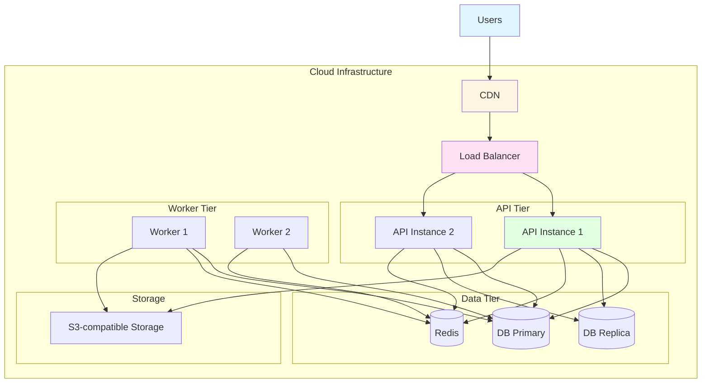

---

*This architecture is designed for clarity, maintainability, and scalability. It follows the principle of starting simple and extracting services only when genuinely necessary.*
